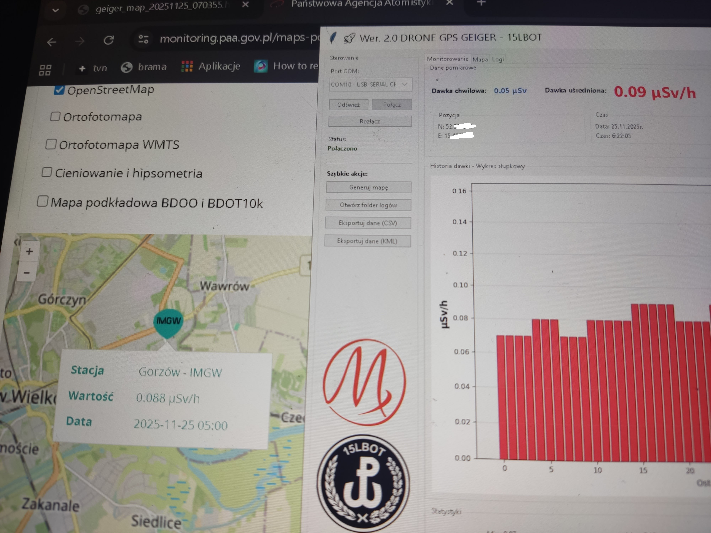

# 🚀 Licznik Geigera - System Mapowania Promieniowania z GPS przeznaczony do szklenia WOT.

Amatorski system do mapowania promieniowania zintegrowany z technologią dronów. Monitoring środowiska w czasie rzeczywistym z pozycjonowaniem GPS i transmisją bezprzewodową.

## 📖 Opis Projektu

System łączy licznik Geigera-Müllera, moduł GPS i komunikację bezprzewodową do tworzenia interaktywnych map promieniowania w czasie rzeczywistym. Zaprojektowany do monitorowania środowiska, badań naukowych, rozpoznawania skażeń  i celów edukacyjnych.
do budowy wykorzystano prosty i tani licznik z aliexpress.

## ✨ Główne Funkcje

- **📡 Pomiar Promieniowania** - Zakres 0.01-100 μSv/h z precyzyjnym monitoringiem
- **🛰️ Precyzyjne Pozycjonowanie GPS** - Współrzędne w czasie rzeczywistym z wyświetlaczem OLED 128/32 lub 128/64
- **📶 dwie możliwości przesyłania danych **:
  1. HC-12 (zasięg do 3 km)
  2. LoRa D02 (zasięg do 12 km)
- **🗺️ Mapowanie w Czasie Rzeczywistym** - Interaktywny interfejs graficzny
- **💾 Eksport Danych** - Formaty CSV i KML do analizy
- **🎯 Automatyczne Generowanie Map** - Poziomy promieniowania oznaczone kolorami

## 🛠️ Komponenty Sprzętowe

### Podstawowe Komponenty
- **Arduino Nano** - Główny kontroler
- **Tuba Geigera-Müllera** (SBM-20 lub podobna)
- **Moduł GPS** NEO-6M/7M
- **Wyświetlacz OLED** 128x32
- **Moduł Bezprzewodowy** HC-12 lub LoRa D02
- **Zasilanie** LiPo 3.7V
(jpg/13.jpg)

### Schemat Podłączenia
